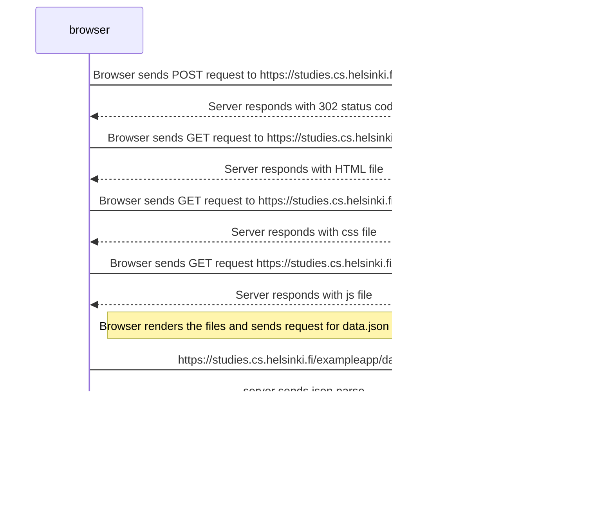

```mermaid

sequenceDiagram
    participant browser
    participant server

    browser->>server:Browser sends POST request to https://studies.cs.helsinki.fi/exampleapp/new_note
    activate server
    server-->>browser:Server responds with 302 status code
    deactivate server

    browser->>server:Browser sends GET request to https://studies.cs.helsinki.fi/exampleapp/notes
    activate server
    server-->>browser:Server responds with HTML file
    deactivate server

    browser->>server:Browser sends GET request to https://studies.cs.helsinki.fi/exampleapp/main.css
    activate server
    server-->>browser:Server responds with css file
    deactivate server

    browser->>server:Browser sends GET request https://studies.cs.helsinki.fi/exampleapp/main.js
    activate server
    server-->>browser:Server responds with js file
    deactivate server

    Note right of browser:Browser renders the files and sends request for data.json file

    browser->>server: https://studies.cs.helsinki.fi/exampleapp/data.json
    activate server
    server-->>browser: server sends json parse
    deactivate server

    Note right of browser: Finally the browser will renders json file and notes shows up
```
