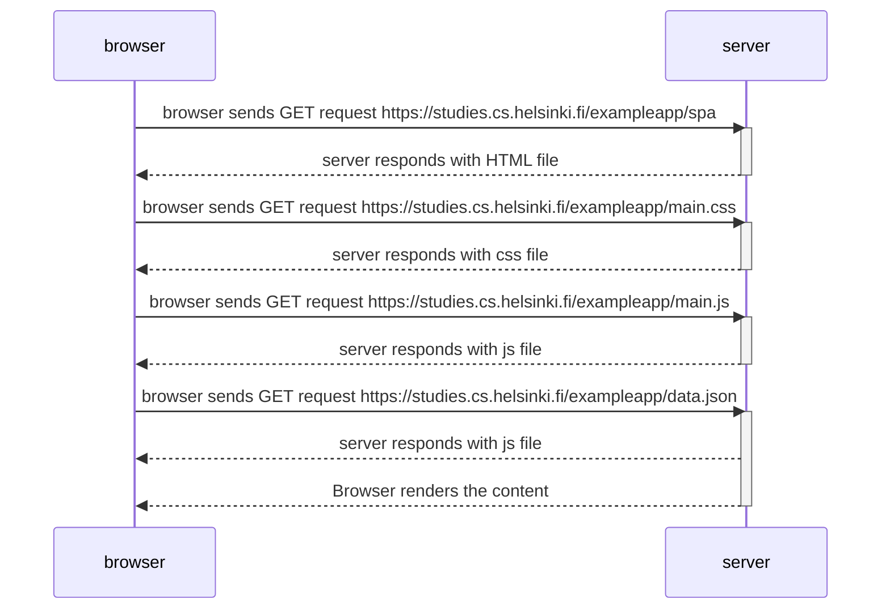

```mermaid

sequenceDiagram
    participant browser
    participant server

    browser->>server:browser sends GET request https://studies.cs.helsinki.fi/exampleapp/spa
    activate server
    server-->>browser:server responds with HTML file
    deactivate server

    browser->>server:browser sends GET request https://studies.cs.helsinki.fi/exampleapp/main.css
    activate server
    server-->>browser:server responds with css file
    deactivate server

    browser->>server:browser sends GET request https://studies.cs.helsinki.fi/exampleapp/main.js
    activate server
    server-->>browser:server responds with js file
    deactivate server

    browser->>server:browser sends GET request https://studies.cs.helsinki.fi/exampleapp/data.json
    activate server
    server-->>browser:server responds with js file
    server-->>browser:Browser renders the content
    deactivate server
```
