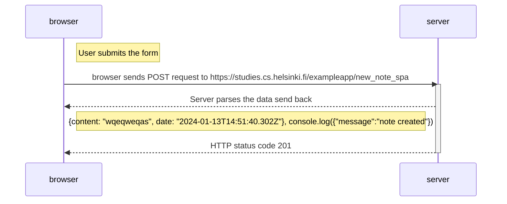

```mermaid

sequenceDiagram
    participant browser
    participant server

    Note right of browser: User submits the form
    browser->>server:browser sends POST request to https://studies.cs.helsinki.fi/exampleapp/new_note_spa
    activate server
    server-->>browser: Server parses the data send back
    Note right of browser: {content: "wqeqweqas", date: "2024-01-13T14:51:40.302Z"}, console.log({"message":"note created"})
    server-->>browser: HTTP status code 201
    deactivate server

```
